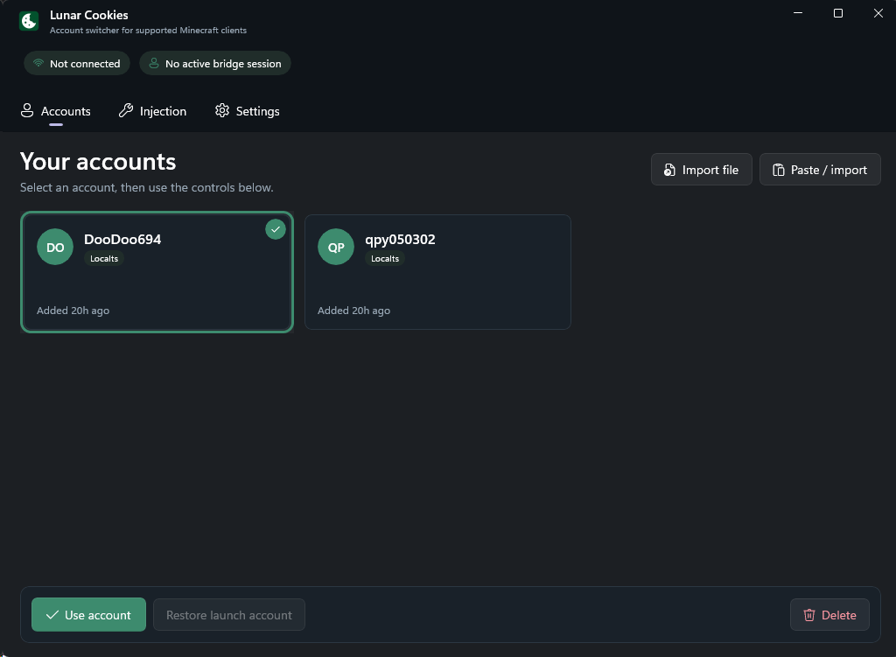

# Lunar Cookie Account Switcher


A portable WinUI 3 account switcher for multiple Minecraft Java clients. It
supports Localts refresh tokens (`M.C…`) and Netscape or cookie-header
Microsoft session cookies.

## Showcase

[](https://youtu.be/t8smWCKkc6M)

Watch the [Lunar Cookies showcase video](https://youtu.be/t8smWCKkc6M).

## Client compatibility

The injected helper resolves the Minecraft singleton and session/user object by
validated runtime structure, with known names used only as fast paths.

- Minecraft 1.8.9: Forge and Lunar Client legacy session shape
- Minecraft 1.21.x: Fabric/intermediary and Lunar + Fabric session shape
- Minecraft 26.1 and 26.2: official-name, Fabric, and Lunar modern user shape

The 1.8.9 four-string constructor, the 1.21 five-argument Yarn session
constructor, and the official 26.1/26.2 `User(String, UUID, String, Optional,
Optional)` ABI are covered. Unknown or ambiguous layouts fail closed; the
bridge will not write to a guessed field.

## Interface

- **Accounts** displays saved accounts in a three-column card grid. Select a
  card and use the bottom bar to switch, restore the account Lunar launched
  with, or delete the saved credentials.
- **Cosmetics** unlocks all cloaks, wings, emotes, badges, and cosmetics in
  Lunar Client's wardrobe. Re-patches in-memory RPC stubs and manages local
  outfit persistence.
- **Servers** lists saved Minecraft servers and a direct-connect field. Join
  uses Minecraft's own connect path, so Lunar's Microsoft-account menu is not
  required. Saved servers can be pinged for latency, player counts, and MOTD.
- Account files can be dragged onto any part of the window. Multiple dropped
  files are authenticated sequentially with spacing between requests.
- Transient Microsoft/Xbox/Minecraft failures are retried with backoff and
  `Retry-After` support. Batch results identify each failed filename and safe
  HTTP status without logging cookies, tokens, or response bodies.
- **Injection** contains bridge connection controls, current Lunar session
  details, process detection, and the diagnostic log.
- **Settings** controls minimize-to-tray behavior, automatic cosmetic unlocking
  on injection or switch, whether the switcher exits automatically after the
  detected Minecraft process closes, and an optional attempt to populate Lunar
  Client's local account manager. That last setting is off by default.
- Switching accounts automatically injects or reconnects the bridge when
  needed. Switching and restoration are blocked while Lunar is in a world or
  connected to a server.
- The interface follows the Windows light or dark theme and keeps the selected
  account and bridge state synchronized between tabs.

## Build

Prerequisites:

- .NET 8 SDK
- Internet access for the first restore of Microsoft Windows App SDK 2.3.1
- MinGW-w64 `g++` for `switcher.dll`
- JDK 8+ (`javac`) for the injected session helper

Build the native bridge and publish the unpackaged, self-contained x64 WinUI 3
application:

```bat
build_dll.bat
build_exe.bat
```

The portable output is written to `publish\`. Distribute
`LunarCookies.exe` and `switcher.dll` together. The WinUI and .NET runtime
dependencies are bundled into the executable and extracted automatically at
startup, so the Windows App SDK runtime does not need to be installed
separately.

For a Debug build:

```bat
build_dll.bat
dotnet run --project LunarCookies -c Debug
```

Run the parser smoke checks with:

```bat
LunarCookies\bin\Debug\net8.0-windows10.0.19041.0\win-x64\LunarCookies.exe --smoke-parser
```

Run the synthetic parser regression suite with:

```bat
dotnet run --project LunarCookies.Tests -c Release
```

## Usage

1. Launch a supported Minecraft client and remain on the main menu.
2. Run `LunarCookies.exe`.
3. On **Accounts**, import a Localts token or cookie file.
4. Select an account and click **Use account**. The bridge connects
   automatically when needed.
5. Open **Servers** and join a host, or use Lunar's own menu if a Microsoft
   account is already signed in there.
6. Disconnect to the main menu before switching or restoring an account.

**Restore launch account** restores the session Lunar started with; it is not a
true signed-out state. **Delete** removes only the saved credentials and does
not change the session currently active in Lunar.

Netscape-format cookie exports, including files named after the account
username, are supported. Cookie filenames do not affect parsing. Cookie
authentication follows Microsoft/Xbox redirects while preserving domain-scoped
cookies and response cookie updates.

## Cracked accounts

**Add cracked** creates an offline-mode profile from a username alone — no
Microsoft account, cookies, or tokens required:

1. Click **Add cracked** on the Accounts tab and enter a Minecraft username
   (3–16 characters of letters, numbers, and underscores; invalid names are
   rejected).
2. Select the card and click **Use account** like any other account. The bridge
   swaps in the session without touching Microsoft authentication.
3. Offline profiles are tagged **Cracked** on their cards and are matched by
   UUID when importing, so the same name can coexist with a premium account.

The UUID is derived with Minecraft's standard offline convention — a v3 (MD5)
UUID over `"OfflinePlayer:" + name` — so offline-mode servers and plugins that
compute UUIDs the same way recognize the account consistently. The access token
is the conventional `"0"` placeholder; offline servers never validate it.

Limitations:

- Cracked sessions only work on servers running in `online-mode=false`. Any
  online server or the Mojang session services will reject them.
- If **Populate Lunar account manager** is enabled, cracked entries are written
  to Lunar's `accounts.json`, but Lunar expects Microsoft credentials and may
  reject or overwrite them on relaunch.
- **Restore launch account** always restores the session Lunar was launched
  with, never a cracked session.

By default, minimizing the window moves Lunar Cookies to the notification area;
double-click its tray icon to restore it. The app also exits after a previously
detected Minecraft process closes. Either behavior can be disabled from
**Settings**.

Accounts remain compatible with earlier releases and are stored at
`%AppData%\LunarCookies\accounts.json`. Tokens are currently stored in
plaintext, so treat this file as a secret.

Preferences are stored at `%AppData%\LunarCookies\settings.json`. Saved servers
are stored at `%AppData%\LunarCookies\servers.json`.

If **Populate Lunar account manager** is enabled, Lunar Cookies writes the
current Microsoft session into `%USERPROFILE%\.lunarclient\settings\game\accounts.json`
using Lunar's own account-file fields, including the MSA refresh token when one
is stored. Lunar reads that file at process start, so the client must be fully
closed and relaunched after a write. Cookie-only accounts that have no refresh
token may still be ignored. The setting is off by default.

- Bridge log: `%TEMP%\lunar_cookies_bridge.log`
- UI crash log: `%TEMP%\lunar_cookies_ui_crash.log`
- TCP control port: `127.0.0.1:25591`

The TCP handshake includes protocol version and target PID. This prevents an
already-running bridge in another Minecraft instance from receiving commands.
Only one bridge can own the fixed port at a time; close other injected
instances before switching accounts.

The local security model and private vulnerability reporting instructions are
documented in [SECURITY.md](SECURITY.md).

## Cosmetics unlocker

Lunar Cookies includes an in-memory cosmetic unlocker for Lunar Client:

- **Wardrobe access**: Unlocks all cloaks, wings, emotes, badges, and cosmetic
  accessories directly inside Lunar Client's native wardrobe screen.
- **In-memory patching**: Dynamically redefines Lunar Client's gRPC stubs
  (`CosmeticService`, `BadgeService`, `EmoteService`, `SprayService`) in JVM
  memory via the native JVMTI bridge without modifying game files on disk.
- **Local persistence**: Outfits, equipped emotes, sprays, and badges are saved
  locally to `%APPDATA%\.minecraft\prometheus\saved\` and restored on subsequent
  game launches.
- **Auto-unlock**: Can be triggered manually from the **Cosmetics** tab or set
  to unlock automatically whenever the bridge connects or an account is switched
  via **Settings**.

## Compatibility design

- The UI selects only a positively identified Minecraft/Lunar Java window; it
  never falls back to an arbitrary Java application.
- The loader uses `LoadLibraryW`, verifies JVM/injector architecture, checks
  complete remote writes, and never frees remote path memory while a timed-out
  loader thread may still be using it.
- DLLs are staged under a content-hashed filename, avoiding stale or locked
  binaries when upgrading.
- The helper validates the current session value and constructor before every
  write, schedules mutations on the Minecraft thread when a scheduler is
  available, re-checks the in-world guard there, and verifies the write.
- Commands are size-limited and diagnostic logs record operation names only;
  access tokens are not written to the bridge log.

Constructor ABI smoke coverage is in
`JavaHelper/SessionSwitcherCompatibilityTest.java`.

## Credits and acknowledgments

- Foundational cookie parsing and authentication flows originated from [In-Game Account Switcher](https://github.com/VidTu/In-Game-Account-Switcher) by The_Fireplace and VidTu.
- Cosmetics unlocking logic, RPC protobuf response schemas, and local outfit persistence architecture are adapted from the [Prometheus](https://github.com/prometheusreengineering/minecraft-lunar) patch by [prometheusreengineering](https://github.com/prometheusreengineering).

## License

Lunar Cookies is licensed under the GNU General Public License version 3 or
later. See `LICENSE` and `NOTICE.md`.
